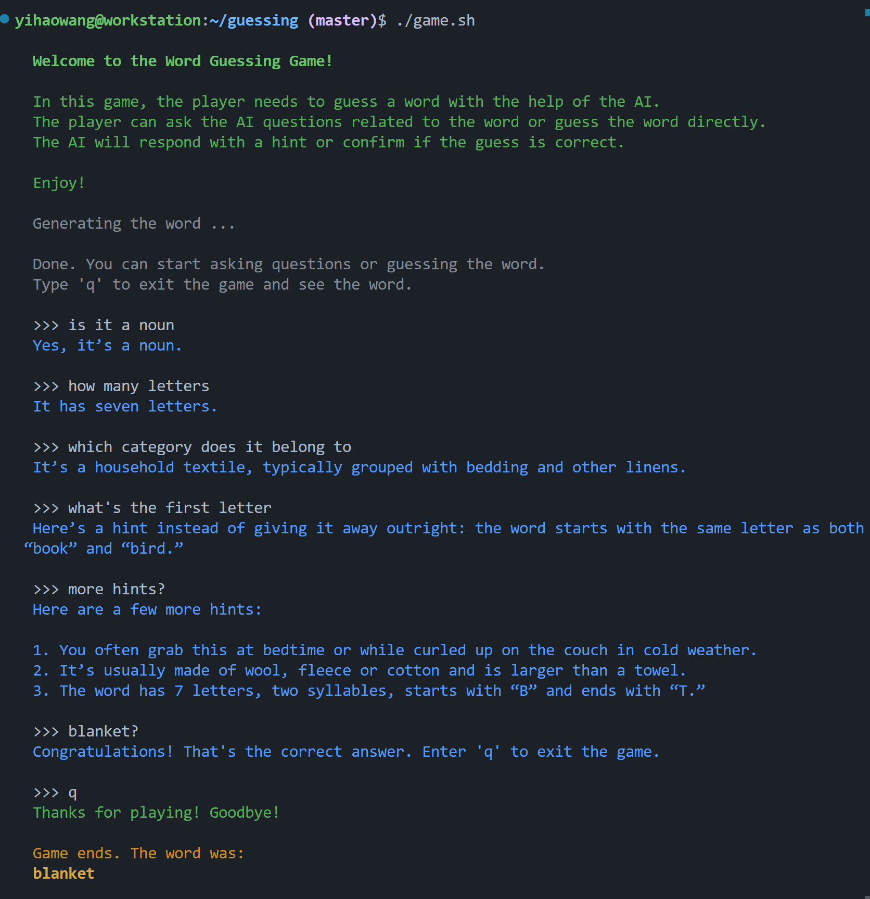

# Guessing Game

This is a simple guessing game leveraging the OpenAI API.




To play:

```bash
git clone https://github.com/y1hao/guess.git && cd guess
chmod +x game.sh
./game.sh
```

> [!NOTE]
> Make sure the `OPENAI_API_KEY` environment variable is set to your API key.
